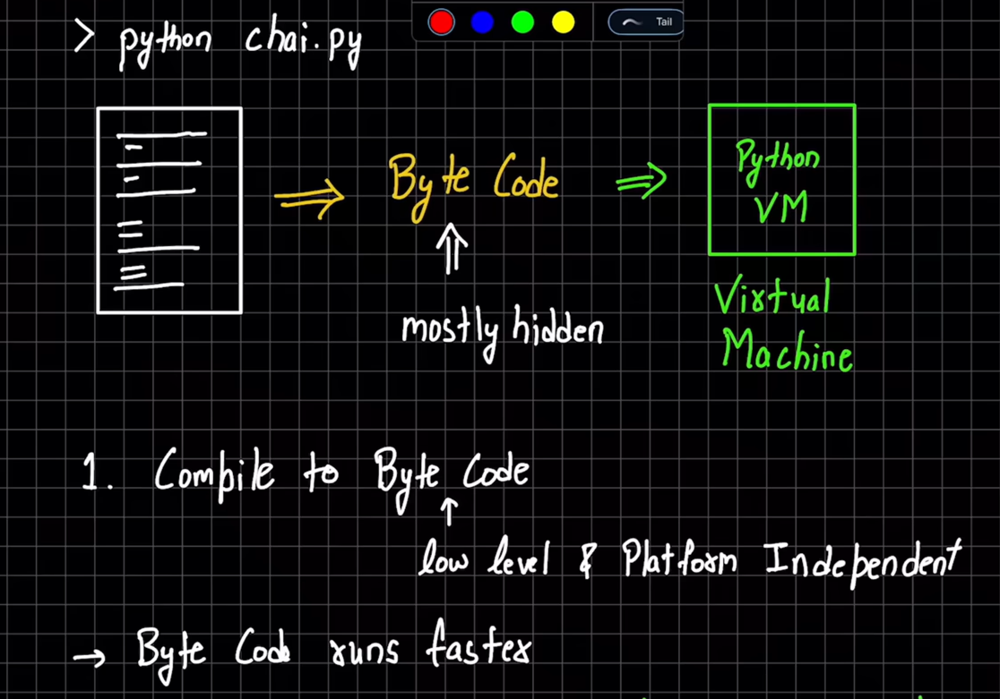
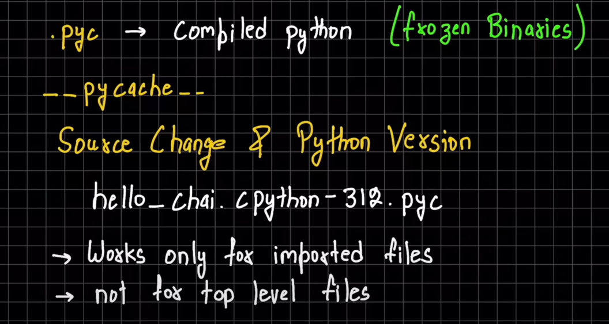
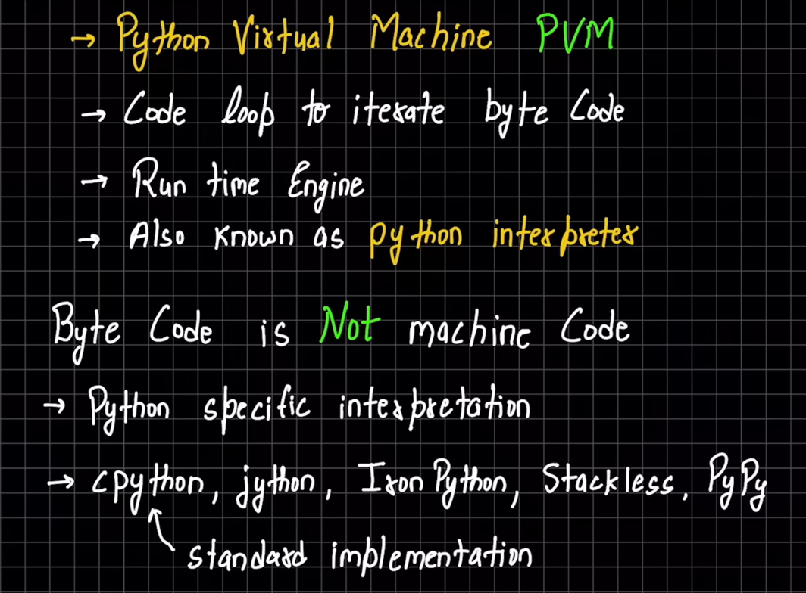

# INNER WORKING OF PYTHON

# IMMUTABLE MEANING
Python assigns a memory and creates reference to that memory where everything is stored as an object assigned particular memory references. Changing reference (for eg: animal = "cat" , animal = "dog" [animal pointed to cat reference and then to dog reference , note that "dog" was not overwritten at assigned memory of "cat"]) is allowed but changing value inside the assigned memory created ("cat" or "dog") is not allowed i.e, are immutable. If an assigned memory is not being referenced by anyone, garbage collector deletes it from the memory.